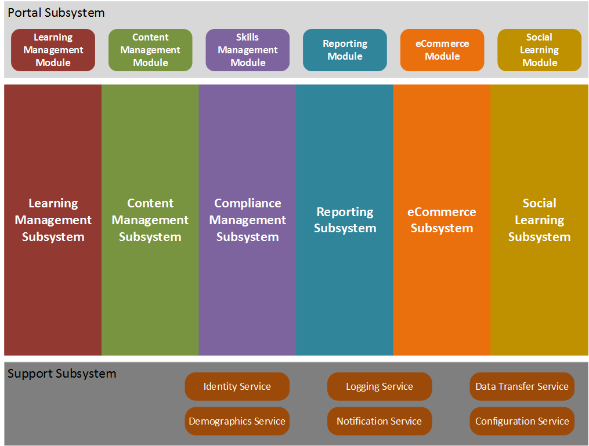
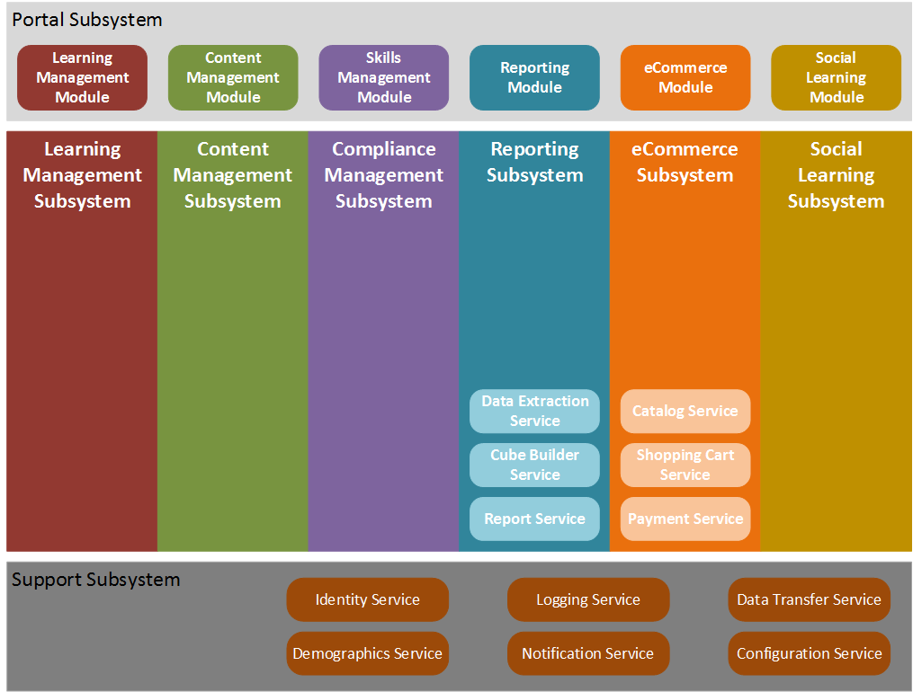
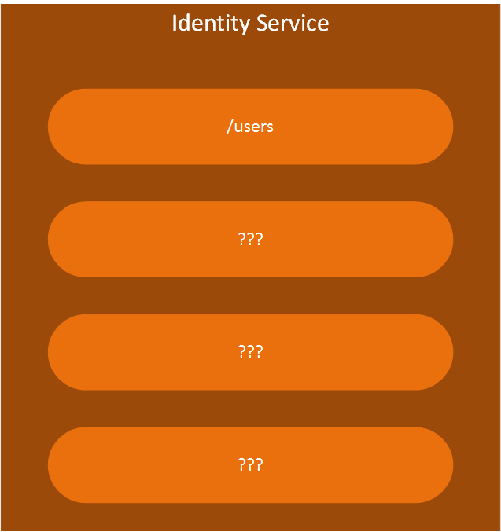
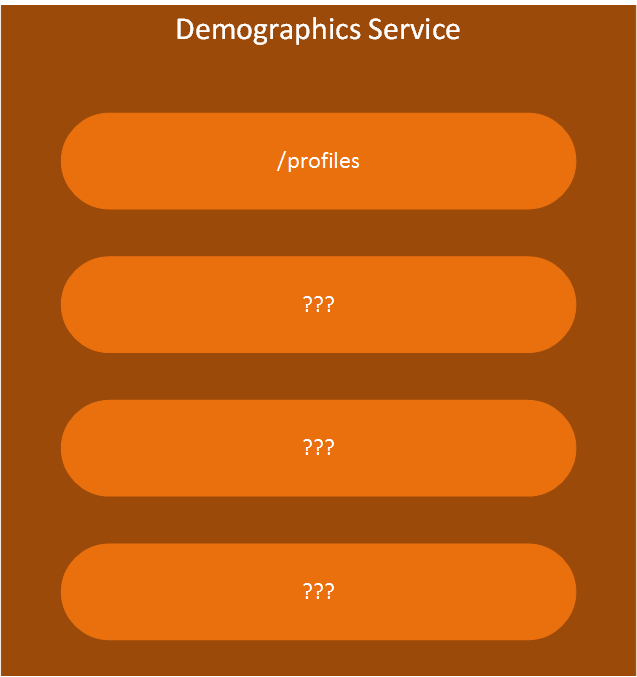
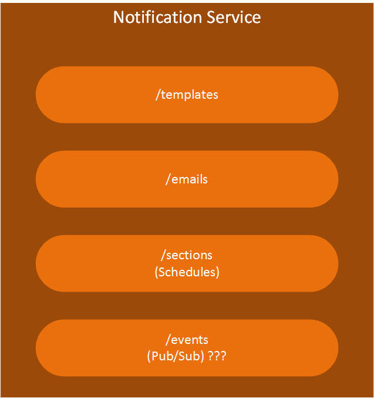
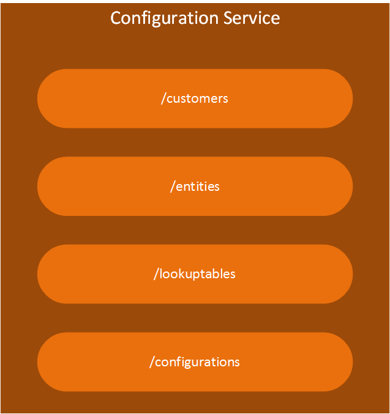

# LMS Logical Architecture

## Overview
It's very important to understand just what it is that is being built.  Prior to the production of requirements and user stories, this understanding is demonstrated through the ability to diagram the system.

## Subsystem Architecture
LMS is a complex system that is composed of multiple subsystems, each with a specific set of responsibilities.  The current understanding of the LMS subystems and the relationships between them is depicted below.

A quick glance at the diagram above should convey that there are 6 feature subsystems, represented by vertical blocks.

1. Learning Management Subsystem
1. Content Management Subsystem
1. Compliance Management Subsystem
1. Reporting Subsystem
1. eCommerce Subsystem
1. Social Learning Subsystem

The feature subsystems interact with the Portal subsystem and a Support subsystem, represented by horizontal bloks.

It is possible to drill down into each of these subsystems for more detail.  Subsystems are composed of modules and services.  And those can be further decomposed.

### Portal Subsystem
The Portal Subystem is responsible for presentation.  It is composed of modules that interact with the feature subsystems.

| Module Name | Description
| :--- | :---
| Learning Management Module | Surface feature functionality from the Learning Management Subsystem
| Content Management Module | Surface feature functionality from the Content Management Subsystem
| Skills Management Module | Surface feature functionality from the Compliance Management Subsystem
| Reporting Module | Surface feature functionality from the Reporting Subsystem
| eCommerce Module | Surface feature functionality from the eCommerce Subsystem
| Social Learning Module | Surface feature functionality from the Social Learning Subsystem

### Learning Management Subsystem

### Content Management Subsystem

### Compliance Management Subsystem

### Reporting Subsystem
#### Data Extraction Service
#### Cube Builder Service
#### Report Service

### eCommerce Subsystem
#### Catalog Service
#### Shopping Cart Service
#### Payment Service

### Social Learning Subsystem

### Support Subsystem
#### Identity Service

##### /users
##### /permissions??
##### /authorizations??

#### Demographics Services

#### Logging Service
#### Notification Service

##### /templates
##### /emails
##### /sections ???
##### /events ???

#### Data Transfer Service
#### Configuration Service

##### /customers
##### /entities
##### /lookuptables
##### /configurations